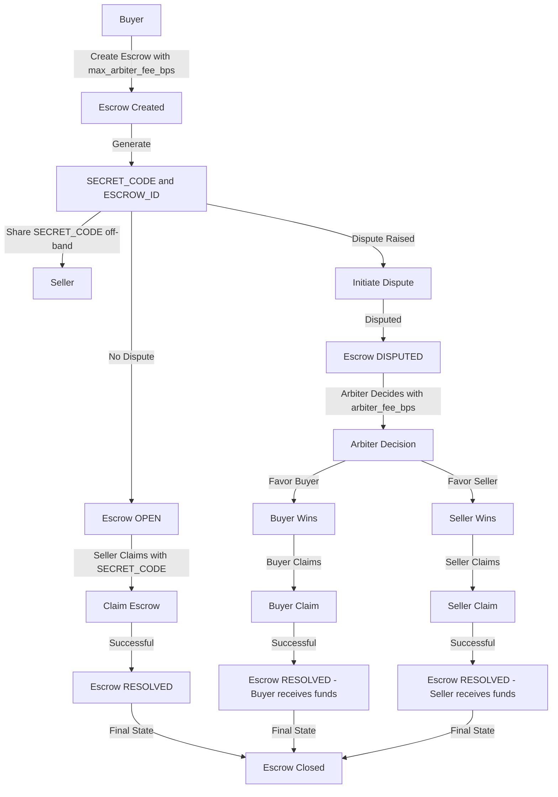

# Escrow Module

The Escrow module of the Fedimint system facilitates secure transactions between a buyer and a seller with the option of involving an arbiter. The process ensures that the buyer can safely transfer funds to the seller for a product or service, with the ability to dispute the transaction if necessary.

## CLI Commands

### 1. Create Escrow

`fedimint-cli module escrow create [SELLER_PUBLIC_KEY] [ARBITER_PUBLIC_KEY] [COST] [MAX_ARBITER_FEE_BPS]`

This command initiates an escrow transaction. It requires:
- Seller's public key
- Arbiter's public key
- Cost of the product/service
- Maximum arbiter fee in basis points (100 basis points = 1%, range: 10-1000)

*This command is to be used by the Buyer only!*
*The public keys can be obtained from the `public-key command`*
*The `arbiter_max_fee_bps` should be in between 10 (0.1%) and 1000 (10%)*

Upon successful execution, you'll receive:
- `secret-code`: Share this with the seller off-band for a successful claim
- `escrow-id`: Unique identifier for the escrow
- `state`: Will be set to "escrow opened!"

### 2. Get Escrow Info

`fedimint-cli module escrow info [ESCROW_ID]`

Fetches information about a specific escrow transaction using its unique ID.

*Can be used by buyer, seller and the arbiter!*

### 3. Claim Escrow

`fedimint-cli module escrow claim [ESCROW_ID] [SECRET_CODE]`

Allows the seller to claim the escrow by providing the escrow ID and the secret code shared by the buyer.

*This command is to be used by the Seller only!*

*You will get an error if the escrow is disputed!*

### 4. Initiate Dispute

`fedimint-cli module escrow dispute [ESCROW_ID]`

Initiates a dispute for an escrow transaction. This command is used when there's a disagreement between the buyer and the seller.

*Both buyer and seller can initiate a dispute.*

Once disputed, and the seller cannot claim the escrow using `secret-code`. The arbiter will decide the outcome, and then the winner will be able to claim the escrow contract.

### 5. Arbiter Decision

`fedimint-cli module escrow arbiter-decision [ESCROW_ID] [DECISION] [ARBITER_FEE_BPS]`

Used by the assigned arbiter to make a decision on a disputed escrow transaction.

*Can only be used by the Arbiter!*

The decision can be either "buyer" or "seller", determining who receives the funds.

### 6. Buyer Claim

`fedimint-cli module escrow buyer-claim [ESCROW_ID]`

Used by the buyer to claim the funds in the escrow when the arbiter decides in favor of the buyer.

### 7. Seller Claim

`fedimint-cli module escrow seller-claim [ESCROW_ID]`

Used by the seller to claim the funds in the escrow when the arbiter decides in favor of the seller.

### 8. Get Public Key

`fedimint-cli module escrow public-key`

Retrieves the public key associated with the escrow module.

## Escrow Module Use Flow

