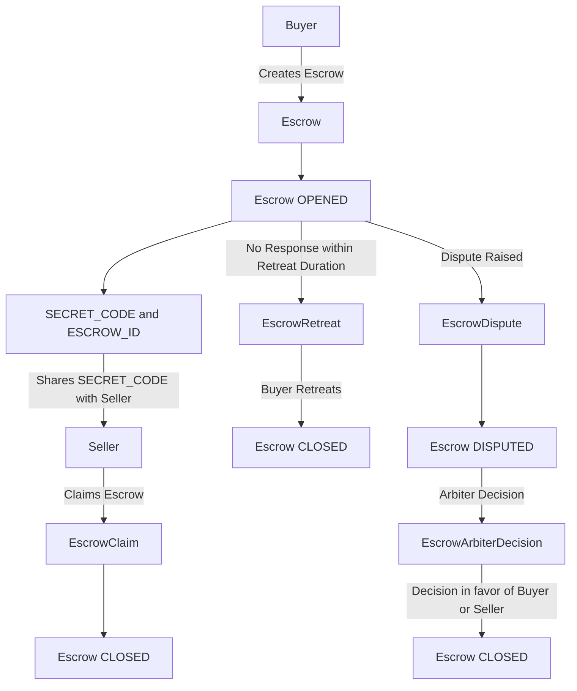

# Escrow Module

The Escrow module of the Fedimint system facilitates secure transactions between a buyer and a seller with the option of involving an arbiter. The process ensures that the buyer can safely transfer funds to the seller for a product or service, with the ability to dispute the transaction if necessary.

## CLI Commands

### 1. Escrow

`fedimint-cli escrow [ARBITER_PUBLIC_KEY] [COST_OF_PRODUCT]`

This command initiates an escrow transaction. It requires details about the arbiter, cost of the products, and the retreat duration (time limit for the transaction, after which the buyer can retreat the escrow if the seller hasn't acted).

*This command has to be used by Buyer only!*

If the command runs successfully, you will get a `SECRET_CODE` (to be shared with the seller off-band for a successful claim), `ESCROW_ID` (unique identifier for the escrow), and the state of the escrow will be `OPENED`.

### 2. EscrowInfo

Fetches information about a specific escrow transaction using its unique ID.

`fedimint-cli EscrowInfo [ESCROW_ID]`

### 3. EscrowClaim

Allows the seller to claim the escrow by providing the escrow ID and a secret code that was shared out of band by the buyer.

`fedimint-cli EscrowClaim [ESCROW_ID] [SECRET_CODE]`

*This command is only to be used by the Seller!*

*You will get an error if the escrow is disputed!*

### 4. EscrowDispute

Initiates a dispute for an escrow transaction. This command is used when there is a disagreement between the buyer and the seller (both can start the dispute), and the arbiter needs to intervene.

`fedimint-cli EscrowDispute [ESCROW_ID] [ARBITER_FEE]`

Once the escrow is disputed, the buyer cannot retreat and the seller cannot claim the escrow! Now the arbiter will decide who gets the ecash.

### 5. EscrowArbiterDecision

Used by the assigned arbiter to make a decision on an escrow transaction that is in dispute.

`fedimint-cli EscrowArbiterDecision [ESCROW_ID] [DECISION]`

*Can only be used by the Arbiter!*

The decision can either be in the favour of `buyer` or the `seller`, whosoever will get the ecash!

### 6. BuyerClaim

Used by the buyer to claim the ecash in the escrow when the arbiter decides in favour of buyer.

### 7. SellerClaim

Used by the seller to claim the ecash in the escrow when the arbiter decides in favour of seller.

## Escrow Module Use Flow

// remove escrow retreat from mermaid

